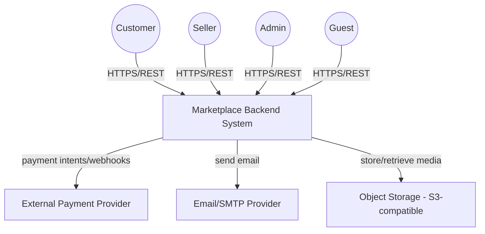
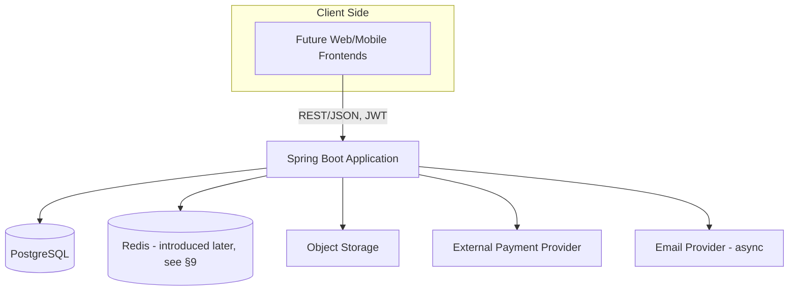
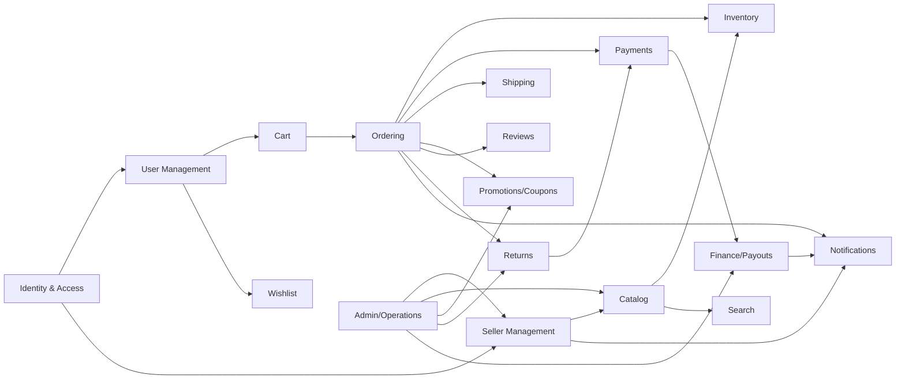
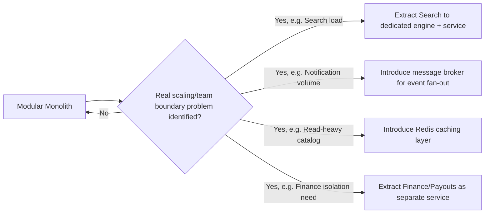

# docs/ARCHITECTURE.md — Architecture (C4-informed)

## 1. Architecture Overview
The system is a **modular monolith** built with Java + Spring Boot, backed by PostgreSQL, deployed as a single application. Internal modules have explicit boundaries (own package, own service interface, no reaching into another module's internals/repositories directly) so that a module could later be extracted into a separate service if a real scaling or team-boundary reason emerges. No microservices, message broker, dedicated search engine, or Kubernetes are introduced at this stage.

## 2. C4 Context Diagram


## 3. C4 Container Diagram


## 4. Module/Component Boundaries

Each module exposes a service-layer interface consumed by other modules; no module accesses another module's repositories/entities directly. This is the internal boundary that would allow future extraction (e.g., Finance/Payouts, Search) if justified.

## 5. Request Flow
```
Client → Controller (REST, validation, auth context)
       → Application/Service Layer (business rules, transaction boundary)
       → Domain logic (invariants, state transitions)
       → Repository (Spring Data JPA)
       → PostgreSQL
```
Asynchronous paths (e.g., email notifications, some webhook post-processing) are handed off from the service layer to a background executor (Spring `@Async` / a lightweight job table) after the core transaction commits, so a slow external call never blocks the customer-facing request.

## 6. Data Architecture
- **PostgreSQL** is the single system of record.
- **JPA/Hibernate** for ORM; explicit `@Version` fields for optimistic locking where appropriate (see ERD §2).
- **Transactions**: service-layer methods define transaction boundaries (`@Transactional`); checkout, coupon redemption, and payout processing are single-transaction critical sections around their atomic updates.
- **Indexing**: targeted indexes on FK columns and frequently filtered/sorted columns (see ERD §2).
- **Full-text search**: PostgreSQL `tsvector`/GIN index on product name+description; ranking via `ts_rank`.
- **Redis**: not used at MVP (see §9/§15 for when it would be introduced).
- **Object storage**: product/variant media binaries live in S3-compatible storage; PostgreSQL stores only URLs/keys and metadata.

## 7. Authentication & Authorization
- Authentication: email+password, hashed with bcrypt/argon2.
- JWT access tokens (short TTL, e.g., 15 min) signed with a server-held secret/key; stateless validation on each request.
- Refresh tokens (longer TTL, e.g., 7–30 days), stored hashed server-side, rotated on use, revocable (logout/security event).
- RBAC: roles Customer/Seller/Admin encoded as claims; a User can carry both Customer and Seller capability simultaneously.
- Resource ownership: enforced in the service layer (e.g., a Seller's product-update service verifies `product.sellerId == currentSeller.id` before mutating), not solely via route-level role checks.
- Admin permissions: separate `ADMIN` authority checked at controller and service layer for all moderation/config endpoints.

## 8. Concurrency & Consistency
| Concern | Strategy |
|---|---|
| Inventory oversell | Atomic conditional SQL update (`stock_quantity = stock_quantity - :qty WHERE stock_quantity >= :qty`) inside the checkout transaction; zero rows affected ⇒ fail that item and abort checkout. |
| Coupon overuse | Atomic conditional update on `redeemed_count` (`WHERE redeemed_count < usage_limit`) in the same transaction as order creation. |
| Duplicate payment webhooks | Idempotency key derived from provider event ID, stored/checked before applying payment-state effects; duplicate deliveries are no-ops. |
| Duplicate client requests (e.g., double-submit checkout) | Client-supplied idempotency key on checkout/payment endpoints, stored per-key result for a bounded window. |
| Payout consistency | `SellerBalance.available_balance` updated via the same transaction that creates the `Payout` (Requested) and the corresponding `LedgerEntry`, with optimistic locking (`version`) to detect concurrent balance mutation; Failed payouts credit the balance back in a follow-up transaction. |
| Order consistency | Seller Order and Order Item creation, inventory decrement, and coupon redemption all occur within one checkout transaction; partial failure rolls back the whole checkout. |

Where an atomic conditional update isn't expressive enough (e.g., a multi-step business rule), pessimistic locking (`SELECT ... FOR UPDATE`) on the specific row is used instead of broad table locks, scoped narrowly and held for the shortest possible time.

## 9. Caching
Caching is deliberately **not** introduced for MVP business-critical paths (inventory, balances) because correctness there depends on always reading current state. Caching becomes justified later for:
- Category tree (read-heavy, low write frequency).
- Product listing pages under high read load (with explicit invalidation on product/price/stock changes).
Redis is the natural candidate when this becomes necessary — introduced as an **evolution**, not at day one.

## 10. Rate Limiting
Rate-limited operations (in-process limiter at MVP; Redis-backed only if scaled beyond a single instance):
- Login attempts (per IP/account).
- Registration (per IP).
- Password reset requests.
- Search queries (per IP/session, to protect DB from abusive scraping).
- Sensitive mutations: checkout, payout requests, coupon application attempts.

## 11. Asynchronous Processing
Handled via a lightweight in-process background mechanism at MVP (e.g., Spring `@Async` + a `notifications`/`outbox`-style table for reliability), not a message broker:
- Email notification delivery.
- Non-critical notification fan-out (in-app + email) after a domain event.
- Post-webhook side effects that are not required to complete before responding 200 to the payment provider (e.g., triggering a notification after payment confirmation is persisted).
Payment webhook **verification and state persistence** itself stays synchronous within the webhook request/transaction; only downstream side effects (emails) go async.

## 12. Observability
- **Structured logging** (JSON) with a request/correlation ID propagated through the call stack and included in every log line.
- **Metrics**: request latency/error rate per endpoint, orders per minute, payment success/failure rate, payout failure rate, inventory-conflict rate (exposed via Micrometer/Actuator).
- **Health checks**: liveness/readiness endpoints (DB connectivity, critical dependency checks).
- **Error tracking**: centralized exception handler maps domain exceptions to consistent error responses and logs stack traces with correlation ID.

## 13. Security
- Passwords: bcrypt/argon2 hashing, never logged.
- JWT: short-lived access tokens, rotated refresh tokens, signature verification on every request.
- Authorization: role + ownership checks in the service layer, defense-in-depth beyond controller-level role annotations.
- Input validation: Bean Validation (`jakarta.validation`) on all request DTOs; domain-level validation for business rules.
- SQL injection: exclusively parameterized queries via JPA/Hibernate; no string-concatenated SQL.
- File upload: type/size allow-list validated before accepting a media reference; files stored in object storage, never executed server-side.
- Rate limiting: see §10.
- Secrets management: DB credentials, JWT signing keys, and payment provider keys sourced from environment/secret store, never committed to source control.
- Sensitive data: payment provider tokens/references stored, not raw card data (PCI scope stays with the provider).

## 14. Deployment & Runtime
```
Local development (Spring Boot + local PostgreSQL via Docker Compose)
  → Docker image build (multi-stage build)
  → CI (build, test, static checks) on every push
  → CD to Staging (single container/environment)
  → Manual/gated promotion to Production (single container/environment, managed PostgreSQL)
```
No Kubernetes cluster is introduced at this stage; a single containerized instance (or a small fixed number behind a load balancer, if/when needed) is sufficient for the modular monolith's expected scale.

## 15. Architecture Evolution

Each evolution step is triggered by a concrete, observed problem (measured via the metrics in §12), not adopted preemptively. Candidates, in likely order of real-world necessity: (1) Redis caching for catalog reads, (2) dedicated search engine if PostgreSQL FTS becomes a bottleneck, (3) message broker if synchronous-in-process async processing becomes insufficient for notification/webhook volume, (4) selective service extraction (e.g., Finance/Payouts, Search) only if a genuine scaling or organizational boundary emerges.
