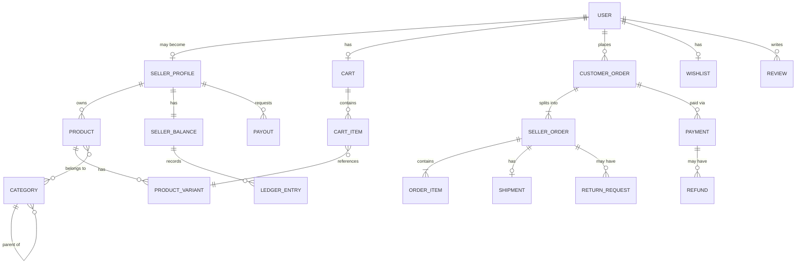
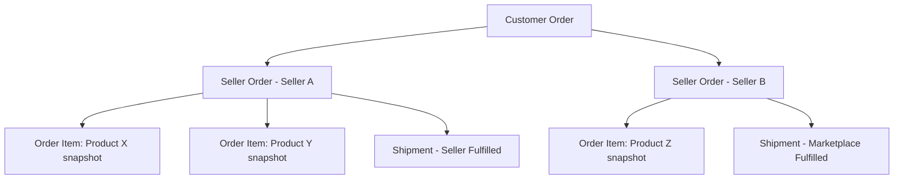
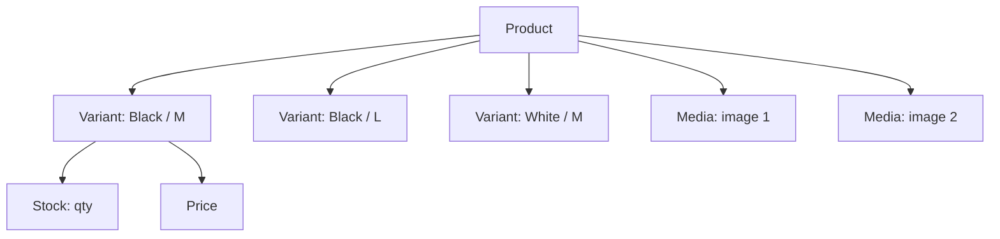
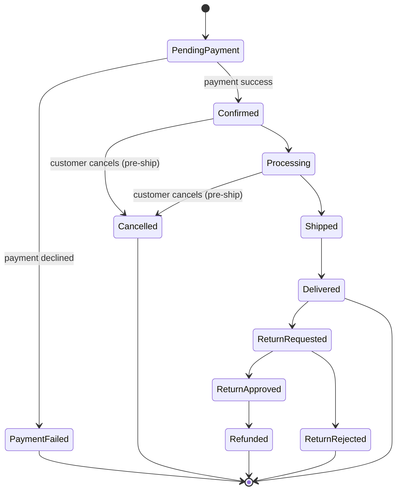
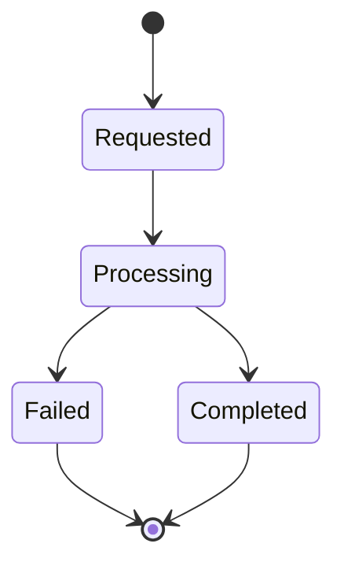
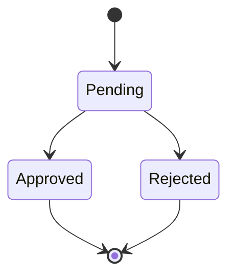

# docs/DOMAIN_MODEL.md — Domain Model

## 1. Purpose
Describes the business concepts, aggregate boundaries, invariants, and state machines behind the marketplace — independent of database schema. See ERD.md for the relational realization.

## 2. Aggregates and Ownership Boundaries

| Aggregate Root | Contains | Owned By |
|---|---|---|
| User | Addresses, Auth credentials | Self |
| SellerProfile | (references SellerApplication) | User (the Seller) |
| Product | Variants, ProductMedia | Seller |
| Category | (tree of Categories) | Marketplace (Admin) |
| Cart | CartItems | Customer or Guest session |
| CustomerOrder | SellerOrders | Customer or Guest |
| SellerOrder | OrderItems, Shipment | Seller (fulfillment), CustomerOrder (belongs to) |
| Payment | — | CustomerOrder |
| Refund | — | Payment, ReturnRequest |
| ReturnRequest | — | SellerOrder / OrderItem |
| Coupon | CouponRedemption records | Marketplace (Admin) |
| Review | — | Customer, Product |
| Wishlist | WishlistItems | Customer |
| Notification | — | User |
| SellerBalance | LedgerEntries | Seller |
| Payout | — | Seller, SellerBalance |

Products are not converted 1:1 into DB tables blindly — e.g., "Product Media" is a value-object-like collection, not a heavyweight aggregate; "Ledger Entry" exists specifically to make SellerBalance auditable rather than a single mutable counter.

## 3. Core Entities & Value Objects

- **User** (Entity): identity, credentials, role flags (Customer/Seller/Admin capability), account state (Active/Suspended).
- **SellerApplication** (Entity): submitted business info, status (Pending/Approved/Rejected), decision metadata.
- **SellerProfile** (Entity): the "Seller" identity once approved; independent suspension state from the underlying User.
- **Address** (Value Object): name, line1/2, city, region, postal code, country, phone — used by both User addresses and guest checkout.
- **Product** (Aggregate Root): name, description, category refs, owning Seller, status (Published/Hidden/Removed).
- **ProductVariant** (Entity within Product): attribute descriptor (e.g., color/size), price, stock quantity, SKU.
- **ProductMedia** (Value Object): URL/key reference, alt text, order — not binary data.
- **Category** (Entity): hierarchical (parent/child), name, slug.
- **Cart / CartItem** (Aggregate Root / Entity): references Variant + quantity, snapshot of price at add-time (advisory only).
- **CustomerOrder** (Aggregate Root): top-level order visible to Customer; guest or registered.
- **SellerOrder** (Entity within CustomerOrder's consistency boundary, but independently mutable for fulfillment concerns): per-seller subset with its own fulfillment/shipping/cancellation/return state.
- **OrderItem** (Entity): purchase-time snapshot (product name, variant descriptor, unit price, quantity) — immutable after creation.
- **Payment** (Aggregate Root): method (COD/Online), state machine, linked to CustomerOrder.
- **Refund** (Entity): amount, reason, linked Payment and optional ReturnRequest.
- **ReturnRequest** (Aggregate Root): linked OrderItem(s)/SellerOrder, state machine.
- **Shipment** (Entity within SellerOrder): fulfillment mode (Marketplace/Seller), tracking info, status.
- **Coupon** (Aggregate Root): code, discount type/value, expiry, usage limits.
- **CouponRedemption** (Entity): links Coupon to CustomerOrder/User, prevents double-count.
- **Review** (Aggregate Root): rating, text, linked verified purchase (OrderItem reference).
- **Wishlist / WishlistItem** (Aggregate Root / Entity): Customer-owned product references.
- **Notification** (Entity): type, payload, read state, channel (in-app/email).
- **SellerBalance** (Aggregate Root): available balance, derived from LedgerEntries.
- **LedgerEntry** (Entity): type (Sale Credit / Refund Debit / Payout Debit), amount, reference to source (SellerOrder/Refund/Payout).
- **Payout** (Aggregate Root): requested amount, state machine, linked SellerBalance.

## 4. Key Invariants
1. A CustomerOrder always has ≥1 SellerOrder, and each SellerOrder belongs to exactly one Seller.
2. An OrderItem's snapshot fields are immutable once created, regardless of later Product/Variant edits.
3. A ProductVariant's stock quantity can never go negative; decrement and order-item creation happen in the same atomic transaction.
4. A Review requires an OrderItem in Delivered state for the same Customer + Product.
5. A Coupon's redemption count can never exceed its usage limit, even under concurrent checkout.
6. A Payout can never exceed the SellerBalance's available amount at the time it is processed.
7. Suspending a User or SellerProfile changes only capability/state flags — it never mutates or removes historical Orders, Payments, Payouts, or Reviews.
8. Commission percentage is read from configuration at the time of SellerOrder settlement, not embedded as a literal in code.

## 5. Domain Events (where justified)
- `SellerApplicationApproved` / `SellerApplicationRejected`
- `OrderPlaced` (per CustomerOrder), `SellerOrderCreated` (per SellerOrder)
- `PaymentConfirmed` / `PaymentFailed`
- `SellerOrderShipped` / `SellerOrderDelivered`
- `ReturnRequested` / `ReturnApproved` / `ReturnRejected`
- `RefundIssued`
- `PayoutRequested` / `PayoutCompleted` / `PayoutFailed`

These events back the Notification module's fan-out (in-app + async email) without coupling Ordering/Payments/Payouts modules directly to Notification internals.

## 6. Diagrams

### 6.1 Aggregate Relationships

### 6.2 Order Structure

### 6.3 Product/Variant Structure

### 6.4 Seller Order State Machine

### 6.5 Payout State Machine

### 6.6 Seller Application State Machine

