# docs/ERD.md — Entity Relationship Diagram

## 1. Diagram

```mermaid
erDiagram
    USERS ||--o{ ADDRESSES : has
    USERS ||--o| SELLER_PROFILES : "may have"
    USERS ||--o{ SELLER_APPLICATIONS : submits
    USERS ||--o| CARTS : owns
    USERS ||--o{ CUSTOMER_ORDERS : places
    USERS ||--o| WISHLISTS : owns
    USERS ||--o{ REVIEWS : writes
    USERS ||--o{ NOTIFICATIONS : receives
    USERS ||--o{ REFRESH_TOKENS : has

    SELLER_PROFILES ||--o{ PRODUCTS : owns
    SELLER_PROFILES ||--|| SELLER_BALANCES : has
    SELLER_PROFILES ||--o{ PAYOUTS : requests
    SELLER_PROFILES ||--o{ SELLER_ORDERS : fulfills

    CATEGORIES ||--o{ CATEGORIES : "parent of"
    CATEGORIES ||--o{ PRODUCT_CATEGORIES : "used in"
    PRODUCTS ||--o{ PRODUCT_CATEGORIES : "categorized as"

    PRODUCTS ||--o{ PRODUCT_VARIANTS : has
    PRODUCTS ||--o{ PRODUCT_MEDIA : has
    PRODUCT_VARIANTS ||--o{ PRODUCT_MEDIA : "may have own"
    PRODUCT_VARIANTS ||--o{ CART_ITEMS : "referenced by"
    PRODUCT_VARIANTS ||--o{ ORDER_ITEMS : "referenced by (at purchase time)"
    PRODUCTS ||--o{ REVIEWS : receives
    PRODUCTS ||--o{ WISHLIST_ITEMS : "saved in"

    CARTS ||--o{ CART_ITEMS : contains

    CUSTOMER_ORDERS ||--|{ SELLER_ORDERS : "splits into"
    CUSTOMER_ORDERS ||--o{ PAYMENTS : "paid via"
    CUSTOMER_ORDERS ||--o{ COUPON_REDEMPTIONS : "may use"
    COUPONS ||--o{ COUPON_REDEMPTIONS : "redeemed via"

    SELLER_ORDERS ||--|{ ORDER_ITEMS : contains
    SELLER_ORDERS ||--o| SHIPMENTS : has
    SELLER_ORDERS ||--o{ RETURN_REQUESTS : "may have"

    RETURN_REQUESTS ||--|{ RETURN_REQUEST_ITEMS : contains
    ORDER_ITEMS ||--o{ RETURN_REQUEST_ITEMS : "returned in"

    PAYMENTS ||--o{ REFUNDS : "may have"
    RETURN_REQUESTS ||--o| REFUNDS : "results in"

    SELLER_BALANCES ||--o{ LEDGER_ENTRIES : records
    PAYOUTS ||--o{ LEDGER_ENTRIES : "debited via"

    WISHLISTS ||--o{ WISHLIST_ITEMS : contains

    USERS {
        uuid id PK
        string email UK
        string password_hash
        string full_name
        string phone
        string status "ACTIVE|SUSPENDED"
        boolean is_admin
        timestamp created_at
    }

    ADDRESSES {
        uuid id PK
        uuid user_id FK
        string line1
        string line2
        string city
        string region
        string postal_code
        string country
        string phone
        boolean is_default
    }

    SELLER_APPLICATIONS {
        uuid id PK
        uuid user_id FK
        string status "PENDING|APPROVED|REJECTED"
        string business_name
        text notes
        timestamp decided_at
        uuid decided_by_admin_id FK
    }

    SELLER_PROFILES {
        uuid id PK
        uuid user_id FK "unique - one seller profile per user"
        string status "ACTIVE|SUSPENDED"
        string display_name
        string payout_method "BANK_TRANSFER|STRIPE|MANUAL"
        text payout_details_json "structured account info"
        timestamp approved_at
    }

    CATEGORIES {
        uuid id PK
        uuid parent_id FK
        string name
        string slug UK
    }

    PRODUCTS {
        uuid id PK
        uuid seller_id FK
        string name
        text description
        string status "PUBLISHED|HIDDEN|REMOVED"
        int version "optimistic lock"
        timestamp created_at
    }

    PRODUCT_CATEGORIES {
        uuid product_id FK
        uuid category_id FK
    }

    PRODUCT_VARIANTS {
        uuid id PK
        uuid product_id FK
        string sku UK
        string attributes_json
        numeric price
        int stock_quantity
        int version "optimistic lock"
    }

    PRODUCT_MEDIA {
        uuid id PK
        uuid product_id FK
        uuid variant_id FK "nullable"
        string url
        string alt_text
        int sort_order
    }

    CARTS {
        uuid id PK
        uuid user_id FK "nullable for guest session"
        string guest_session_token "nullable"
        timestamp updated_at
    }

    CART_ITEMS {
        uuid id PK
        uuid cart_id FK
        uuid variant_id FK
        int quantity
        numeric price_snapshot
    }

    CUSTOMER_ORDERS {
        uuid id PK
        uuid user_id FK "nullable for guest"
        string guest_email "nullable"
        string guest_name "nullable"
        string guest_phone "nullable"
        uuid shipping_address_id FK "nullable, or embedded snapshot"
        numeric total_amount
        string status
        timestamp created_at
    }

    SELLER_ORDERS {
        uuid id PK
        uuid customer_order_id FK
        uuid seller_id FK
        numeric subtotal_amount
        numeric commission_amount
        numeric seller_revenue_amount
        string fulfillment_status
        string cancellation_status
        int version "optimistic lock"
    }

    ORDER_ITEMS {
        uuid id PK
        uuid seller_order_id FK
        uuid variant_id FK "reference only, not source of truth"
        string product_name_snapshot
        string variant_descriptor_snapshot
        numeric unit_price_snapshot
        int quantity
    }

    PAYMENTS {
        uuid id PK
        uuid customer_order_id FK
        string method "COD|ONLINE"
        string status "PENDING|CONFIRMED|FAILED"
        string provider_reference "nullable"
        numeric amount
        timestamp created_at
    }

    REFUNDS {
        uuid id PK
        uuid payment_id FK
        uuid return_request_id FK "nullable"
        numeric amount
        string status
        timestamp created_at
    }

    SHIPMENTS {
        uuid id PK
        uuid seller_order_id FK "unique - one shipment per seller order"
        string fulfillment_mode "MARKETPLACE|SELLER"
        string tracking_number "nullable"
        string status
        timestamp shipped_at
        timestamp delivered_at
    }

    RETURN_REQUESTS {
        uuid id PK
        uuid seller_order_id FK
        string status "PENDING|APPROVED|REJECTED"
        text reason
        timestamp requested_at
        timestamp decided_at
    }

    RETURN_REQUEST_ITEMS {
        uuid id PK
        uuid return_request_id FK
        uuid order_item_id FK
        int quantity
        numeric refund_amount
    }

    COUPONS {
        uuid id PK
        string code UK
        string discount_type "PERCENTAGE|FIXED"
        numeric discount_value
        timestamp expires_at
        int usage_limit
        int redeemed_count
    }

    COUPON_REDEMPTIONS {
        uuid id PK
        uuid coupon_id FK
        uuid customer_order_id FK
        uuid user_id FK "nullable for guest"
    }

    REVIEWS {
        uuid id PK
        uuid product_id FK
        uuid user_id FK
        uuid order_item_id FK "proof of verified purchase"
        int rating
        text comment
        timestamp created_at
    }

    WISHLISTS {
        uuid id PK
        uuid user_id FK "unique - one wishlist per user"
    }

    WISHLIST_ITEMS {
        uuid id PK
        uuid wishlist_id FK
        uuid product_id FK
    }

    NOTIFICATIONS {
        uuid id PK
        uuid user_id FK
        string type
        string channel "IN_APP|EMAIL"
        boolean read
        string delivery_status "PENDING|SENT|FAILED"
        int retry_count
        timestamp sent_at "nullable"
        text error_message "nullable"
        text payload_json
        timestamp created_at
    }

    SELLER_BALANCES {
        uuid id PK
        uuid seller_id FK "unique - one balance per seller"
        numeric available_balance
        int version "optimistic lock"
    }

    LEDGER_ENTRIES {
        uuid id PK
        uuid seller_balance_id FK
        string entry_type "SALE_CREDIT|REFUND_DEBIT|PAYOUT_DEBIT"
        numeric amount
        uuid reference_id "seller_order_id | refund_id | payout_id"
        timestamp created_at
    }

    PAYOUTS {
        uuid id PK
        uuid seller_id FK
        numeric requested_amount
        string status "REQUESTED|PROCESSING|COMPLETED|FAILED"
        timestamp requested_at
        timestamp completed_at
    }

    REFRESH_TOKENS {
        uuid id PK
        uuid user_id FK
        string token_hash
        boolean revoked
        timestamp expires_at
    }

    MARKETPLACE_SETTINGS {
        string setting_key PK
        string setting_value
        string description
        timestamp updated_at
        uuid updated_by_admin_id FK
    }

    IDEMPOTENCY_RECORDS {
        string idempotency_key PK
        string endpoint
        uuid user_id FK "nullable"
        int response_status
        text response_body
        timestamp created_at
        timestamp expires_at
    }
```

## 2. Design Notes

### Referential Integrity
All FKs enforce referential integrity except where a nullable FK is intentional (e.g., `customer_orders.user_id` nullable for guest orders).

### Unique Constraints
- `users.email` unique.
- `seller_profiles.user_id` unique (one Seller Profile per User).
- `product_variants.sku` unique.
- `categories.slug` unique.
- `coupons.code` unique.
- `shipments.seller_order_id` unique (one Shipment per Seller Order).
- `seller_balances.seller_id` unique (one balance ledger owner per Seller).
- `wishlists.user_id` unique (one wishlist per Customer).
- `return_request_items(return_request_id, order_item_id)` unique (an order item is returned only once per request).
- Recommended: unique `(user_id, product_id, order_item_id)` on `reviews` to ensure exactly one review per verified delivered purchase item.

### Check Constraints
- `product_variants.stock_quantity >= 0`.
- `coupons.redeemed_count <= coupons.usage_limit`.
- `payouts.requested_amount <= seller_balances.available_balance` (enforced at application/transaction level, not purely DB check, due to cross-row nature).
- `order_items.quantity > 0`, `payments.amount > 0`.
- `return_request_items.quantity > 0`.

### Indexes
- `products(seller_id)`, `products(status)` for seller/admin listing queries.
- `product_variants(product_id)`.
- `product_categories(category_id)`, `product_categories(product_id)`.
- Full-text index (GIN, `tsvector`) on `products(name, description)` for search.
- `customer_orders(user_id)`, `customer_orders(guest_email)`.
- `seller_orders(seller_id)`, `seller_orders(customer_order_id)`.
- `order_items(seller_order_id)`.
- `return_request_items(return_request_id)`.
- `ledger_entries(seller_balance_id)`.
- `categories(parent_id)` for hierarchy traversal (with recursive CTEs).
- `notifications(delivery_status, created_at)` for outbox poller queries.
- `idempotency_records(expires_at)` for TTL cleanup jobs.

### Soft Deletion
Used only where genuinely useful: `products.status = REMOVED` (soft) rather than hard-delete, because historical Order Items reference variant IDs and reviews reference products. Categories are hard-deleted only if unused; otherwise reassignment is required (assumption). Users/Sellers use a `status` flag (Suspended) rather than deletion, per business rule.

### Historical Data Preservation
`order_items` stores denormalized snapshot columns (`product_name_snapshot`, `variant_descriptor_snapshot`, `unit_price_snapshot`) so edits to `products`/`product_variants` never retroactively change historical orders. The `variant_id` FK is kept only for traceability/analytics, not as the source of truth for display.

### Partial Returns & Refunds
`return_requests` represents the return request header, while `return_request_items` stores the individual order items and returned quantities. This permits partial order returns while maintaining granular traceability down to the specific `order_item_id` and corresponding refund amounts.

### Outbox Pattern for Asynchronous Notifications
`notifications` incorporates `delivery_status`, `retry_count`, `sent_at`, and `error_message`. When domain events occur within transactions (e.g., order placed, shipment updated), notification records are inserted atomically with `delivery_status = PENDING`. A decoupled asynchronous dispatcher/poller delivers emails and records completion or errors without compromising the triggering request thread.

### Idempotency Records
`idempotency_records` provides persistence for mutation idempotency across application restarts. The unique `idempotency_key` ensures that duplicate checkout submissions or financial transactions return the cached original response without creating duplicate entities or charges.

### Monetary Precision
All monetary columns use `NUMERIC(12,2)` (or higher precision if multi-currency is later introduced) — never `FLOAT`/`DOUBLE`.

### Concurrency-Related Fields
- `product_variants.version`, `products.version`, `seller_orders.version`, `seller_balances.version` support optimistic locking (JPA `@Version`) to guard concurrent price/stock/balance updates.
- Inventory decrement at checkout is additionally protected by a guarded atomic SQL update (`UPDATE ... SET stock_quantity = stock_quantity - :qty WHERE id = :id AND stock_quantity >= :qty`) rather than relying on optimistic locking alone, since optimistic locking alone would require retry loops under contention; the atomic conditional update is the primary safeguard, with `version` as a secondary/general-purpose concurrency guard for other fields.
- `coupons.redeemed_count` is incremented via a similar atomic conditional update (`WHERE redeemed_count < usage_limit`).